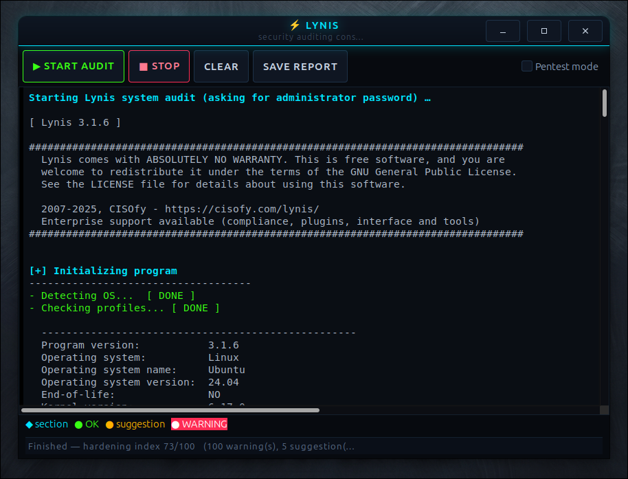

<div align="center">

<a href="https://github.com/effjy/lynis-gui/"></a>

**A friendly GTK3 front-end for [Lynis](https://cisofy.com/lynis/) — security audits with color, live.**

[](https://opensource.org/licenses/MIT)
[](https://en.wikipedia.org/wiki/C_(programming_language))
[](https://www.gtk.org/)
[](https://cisofy.com/lynis/)
[](https://www.kernel.org/)
[](https://github.com/effjy/lynis-gui/issues)
[](https://github.com/effjy/lynis-gui/commits)
[](https://github.com/effjy/lynis-gui/pulls)

</div>

Lynis is an excellent security auditing and hardening tool, but its output is a
long scroll of `[ OK ]` / `[ WARNING ]` / `[ SUGGESTION ]` lines that is hard to
skim in a terminal. This little C program runs the audit and shows the results
**live, in a window, color-coded**, so the things that matter stand out.

## 📸 Screenshot

<div align="center">

<!-- Replace screenshot.png with your own capture of the running program. -->


</div>

## Features

- **Live output** — each line appears as Lynis produces it, not all at once at the end.
- **Color-coded results** based on Lynis's own `[ STATUS ]` markers:
  - 🟢 **green** — `OK` / `DONE` / `ENABLED` / `FOUND` / `HARDENED` (good)
  - 🟡 **amber** — `SUGGESTION` / `WEAK` / `DISABLED` (review when you can)
  - 🔴 **red** — `WARNING` / `DANGER` (act now)
  - 🔵 **cyan** — section headers (`[+] Boot and services`)
- **Pentest mode** checkbox — adds `--pentest` for extra exposure/weak-config checks.
- **Live counters** in the status bar (warnings / suggestions), plus the final
  **hardening index** (0–100) parsed from the summary.
- **Stop**, **Clear**, and **Save report…** buttons.
- Application icon + taskbar/window icon and a desktop menu entry.
- Runs `lynis` through **`pkexec`** for the root password when you aren't already root.

## Requirements

- GTK 3 development files — `sudo apt install libgtk-3-dev`
- `lynis` — `sudo apt install lynis`
- `pkexec` (from `policykit-1`, normally already installed) for the password prompt
- A C compiler and `make`

## Build

```bash
git clone https://github.com/effjy/lynis-gui.git
cd lynis-gui
make
```

## Run

```bash
make run          # build + run from this directory
# or, after installing:
lynis-gui
```

Click **Start audit**. When you aren't root, a graphical password dialog appears
(via `pkexec`) because Lynis needs root to inspect the system.

The audit is run with `--quick` (so it never pauses for a keypress) and
`--no-colors` (the GUI applies its own colors).

## Install / Uninstall

```bash
sudo make install     # installs the binary, icon and menu entry under /usr/local
sudo make uninstall   # removes them
```

`make install` puts:

| File | Destination |
|------|-------------|
| `lynis-gui` | `/usr/local/bin/` |
| `lynis-gui.svg` | `/usr/local/share/icons/hicolor/scalable/apps/` |
| `lynis-gui.desktop` | `/usr/local/share/applications/` |

After installing, the program appears in your application menu under
**System / Security**.

## Notes

Lynis also writes a full log to `/var/log/lynis.log` and machine-readable report
data to `/var/log/lynis-report.dat`; the GUI reminds you of these paths when the
audit finishes. A typical clean desktop still produces many suggestions — Lynis
is thorough, and a hardening index in the 60–80 range is normal for a general-use
machine.

## Files

| File | Purpose |
|------|---------|
| `lynis-gui.c` | The program (C / GTK3) |
| `Makefile` | Build, `run`, `install`, `uninstall` targets |
| `lynis-gui.svg` | Application / window icon |
| `lynis-gui.desktop` | Application menu launcher |

## License

MIT.
